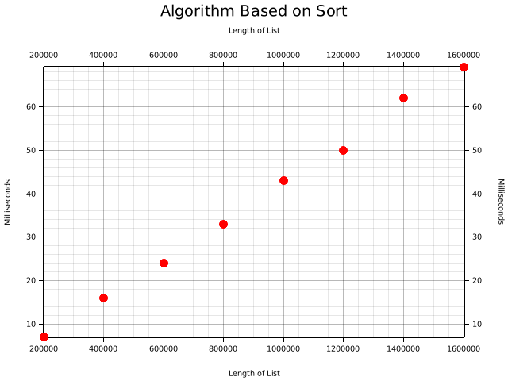

# Puzzle
## Smallest Value Not In The List
Find the smallest non-negative integer that is not in the list.

Constraints:
 * The list will only contain positive integers or zero.
 * The list could be in any order.

Examples:
 * [0, 1, 2, 3, 5] -> 4
 * [0, 1, 3, 4, 5] -> 2
 * [2, 1, 0] -> 3
 * [20, 10, 30] -> 0

Challenges:
 * Use functional programming techniques.
 * Find a solution that runs in linear time.
 * Measure computation time to confirm whether it is linear time.

## Functional Programming
I could not devise any sensible implementation of a linear time solution in the functional
programming style, therefore to use functional programming:
* Sort the list.
* If the list starts with a number bigger than zero or is empty:
  * Answer is 0.
* Otherwise:
  * Compare each number with the next number to see if they are consecutive (differ by 1).
  * Find the first number that is non-consecutive.
  * Add one to that number to get the answer.

```rust
fn get_min_not_in_list_via_sort(vals: &Vec<u32>) -> u32 {
    let mut sorted = vals.clone();
    sorted.sort();
    if sorted.is_empty() || sorted[0] > 0 {
        0
    } else {
        (0..sorted.len())
            .skip_while(|i| i + 1 < sorted.len() && sorted[i + 1] - sorted[*i] <= 1)
            .next()
            .map(|i| sorted[i] + 1)
            .unwrap()
    }
}
```

## Linear Time Solution
I did not find any sensible functional programming solution so instead the linear
time solution uses imperative programming.

Find groups of consecutive numbers, so in the example [0, 1, 2, 3, 5]
there are consecutive numbers from 0-3 and 5.

Can iterate through the numbers in any order and for each number store
the lower bound and upper bound of the current consecutive range.

In each iteration, the two adjacent numbers need to be checked, and
relevant lower and upper bounds need to be updated.

In the below example, the notation used is as follows for the contents
of the HashMap:
* key -> (lower_bound, upper_bound)

Thus, iterating through the list in this order [3, 1, 2, 0, 5]:
* Insert 3
  * 3 -> (3,3)
* Insert 1
  * 1 -> (1,1)
  * 3 -> (3,3)
* Insert 2
  * 1 -> (1,3)
  * 2 -> midrange
  * 3 -> (1,3)
* Insert 0
  * 0 -> (0,3)
  * 1 -> midrange
  * 2 -> midrange
  * 3 -> (0,3)
* Insert 5
  * 0 -> (0,3)
  * 1 -> midrange
  * 2 -> midrange
  * 3 -> (0,3)
  * 5 -> (5,5)

```rust
fn get_min_not_in_list_via_hash(vals: &Vec<u32>) -> u32 {
    let mut curr_min: u32 = u32::MAX;
    let mut consecutives: HashMap<u32, RangeDef> = HashMap::with_capacity(vals.len());
    for val in vals {
        if curr_min > *val {
            curr_min = *val;
        }
        if !consecutives.contains_key(&val) {
            let u_bound = match consecutives.get(&(val + 1)) {
                Some(range_def) => match range_def {
                    MidRange => *val,
                    EdgeVal(r) => r.high,
                },
                None => *val,
            };

            let l_bound = if *val == 0 {
                0
            } else {
                match consecutives.get(&(val - 1)) {
                    Some(range_def) => match range_def {
                        MidRange => *val,
                        EdgeVal(r) => r.low,
                    },
                    None => *val,
                }
            };

            consecutives.insert(u_bound, EdgeVal(RangeInclusive::new(l_bound, u_bound)));
            consecutives.insert(l_bound, EdgeVal(RangeInclusive::new(l_bound, u_bound)));

            if val + 1 < u_bound {
                consecutives.insert(val + 1, MidRange);
            }

            if *val > 0 && val - 1 > l_bound {
                consecutives.insert(val - 1, MidRange);
            }

            if *val > l_bound && *val < u_bound {
                consecutives.insert(*val, MidRange);
            }
        }
    }

    if curr_min > 0 {
        0
    } else {
        match &consecutives[&0] {
            MidRange => panic!("Zero cannot be midrange in consecutive numbers"),
            EdgeVal(r) => r.high + 1,
        }
    }
}
```

Problems:
* Memory allocation - If using hashmap need to allocate memory larger than size of original list.
* Seems to be slower compared to simply sorting the list.


## Computation Time
### Console Output
```text
time target/release/puzzle-min-unused
[ComputeTime { size: 200000, duration: 7.742453ms }, ComputeTime { size: 400000, duration: 16.102214ms }, ComputeTime { size: 600000, duration: 24.392358ms }, ComputeTime { size: 800000, duration: 33.475401ms }, ComputeTime { size: 1000000, duration: 43.287631ms }, ComputeTime { size: 1200000, duration: 50.619033ms }, ComputeTime { size: 1400000, duration: 62.124688ms }, ComputeTime { size: 1600000, duration: 69.358272ms }]

[ComputeTime { size: 200000, duration: 7.658816ms }, ComputeTime { size: 400000, duration: 17.115468ms }, ComputeTime { size: 600000, duration: 29.714433ms }, ComputeTime { size: 800000, duration: 43.270202ms }, ComputeTime { size: 1000000, duration: 59.531474ms }, ComputeTime { size: 1200000, duration: 61.298695ms }, ComputeTime { size: 1400000, duration: 75.804416ms }, ComputeTime { size: 1600000, duration: 98.635212ms }]
Result has been saved to images/chart_01_via_sort.png
Result has been saved to images/chart_02_via_hash.png

real    0m0.729s
user    0m0.698s
sys     0m0.030s
```

### Charts
 

## General Notes
* The supposedly linear time hash map approach is slower than sorting.
* In Rust the "release" profile is much faster than the "debug" profile.
* The Hash approach seems to have a lot of variation in speed.
* Source code is in the src folder. A lot of the code is related to plotting the charts.
